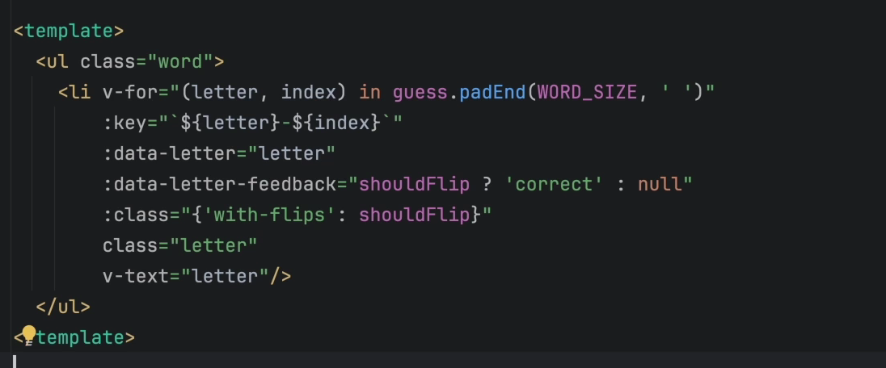
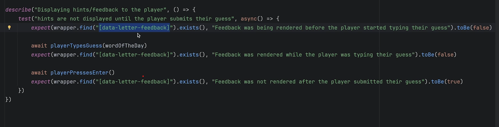
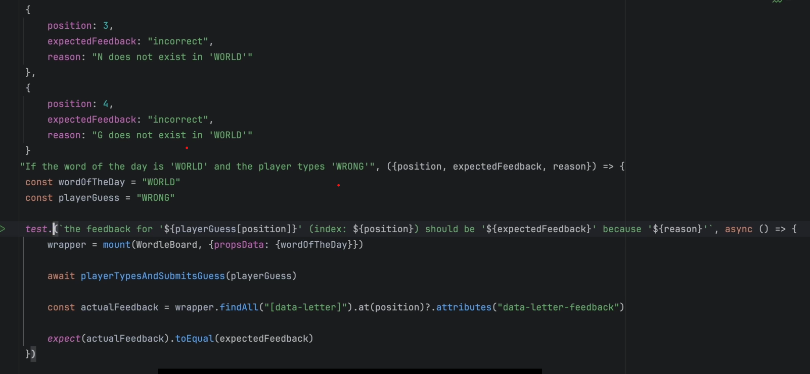
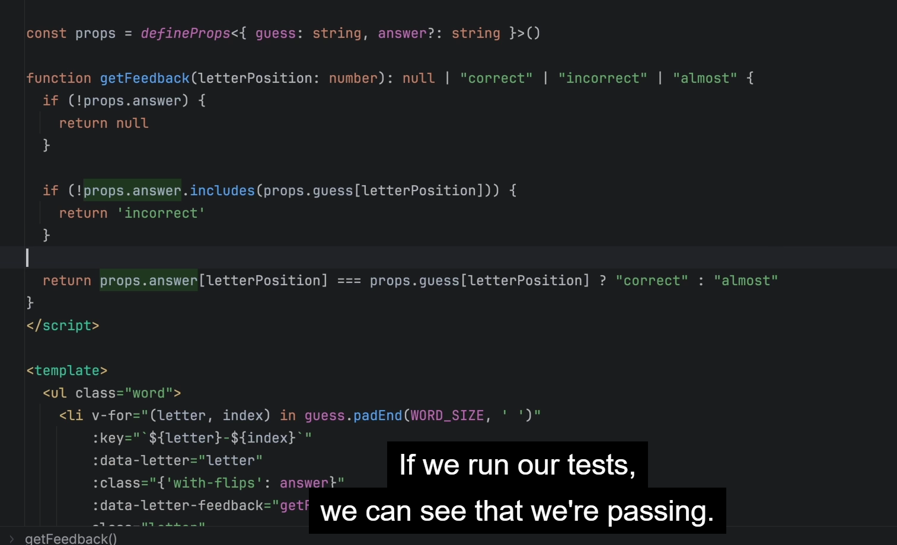

# TODO

## hide input and replace with 6 blocs cases

- faire un component guess-view et lui envoyer en props le guessFormated qui est en train d'etre taper
- faire un rendu de la lettre tapper
- disable les lettres si ended game

hint:

## donner des indices pour trouver le bon mots

- en vert: la lettre qui correspond
- en jaune: la lettre mal placé
- en gris: la lettre qui n'est pas dans le mot

hint test :

- no feeback is show until user type enter - On type enter there is a dataset added data-letter-feedback
  

- for each letter, check letter, and send 3 types of feedback 'correct', 'incorrect', 'almost', inside data-letter-feedback (html)
- styles css: regarding the type of feedback, you style the letter

ended by

